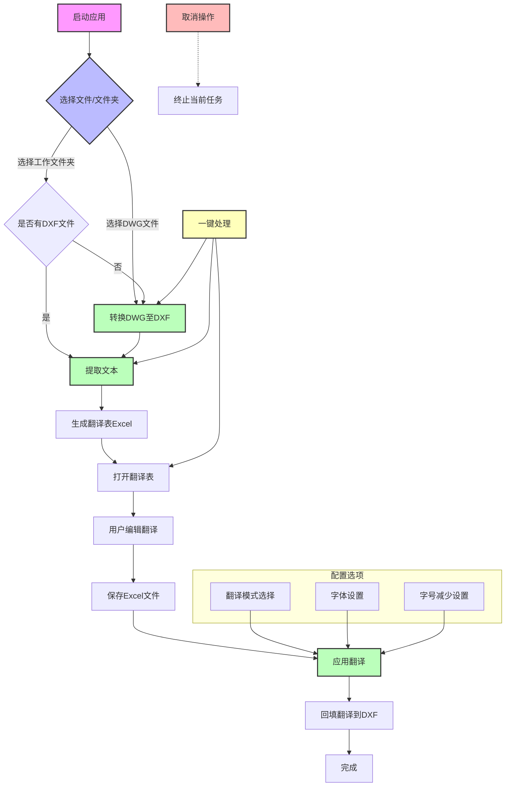

# CAD翻译工具GUI流程图

## 流程图说明

1. **启动应用**：用户双击 `start_gui.bat` 启动CAD翻译工具
2. **选择文件/文件夹**：用户可以选择DWG文件或工作文件夹
3. **转换DWG至DXF**：如果选择了DWG文件，系统会使用AutoCAD COM接口将其转换为DXF格式
4. **提取文本**：系统从DXF文件中提取文本内容
5. **生成翻译表**：系统生成 `extracted_texts.xlsx` 文件，包含提取的文本
6. **打开翻译表**：系统自动打开Excel文件供用户编辑
7. **用户编辑翻译**：用户在Excel中填写翻译内容
8. **保存Excel文件**：用户保存编辑后的翻译表
9. **应用翻译**：系统将翻译结果回填到DXF文件中
10. **完成**：翻译处理完成

## 特殊功能

- **一键处理**：自动完成转换、提取、打开翻译表的全过程
- **取消操作**：用户可以随时取消正在进行的任务
- **配置选项**：用户可以设置翻译模式、字体和字号减少值

## 技术流程

1. **文件选择**：使用tkinter的文件对话框选择文件或文件夹
2. **DWG转换**：使用AutoCAD COM接口进行高性能转换
3. **文本提取**：使用ezdxf库从DXF文件中提取文本
4. **翻译表生成**：使用pandas和openpyxl生成Excel文件
5. **翻译回填**：使用ezdxf库将翻译结果写回DXF文件
6. **线程管理**：使用多线程处理耗时操作，保持UI响应
7. **日志记录**：使用logging模块记录操作过程和错误信息