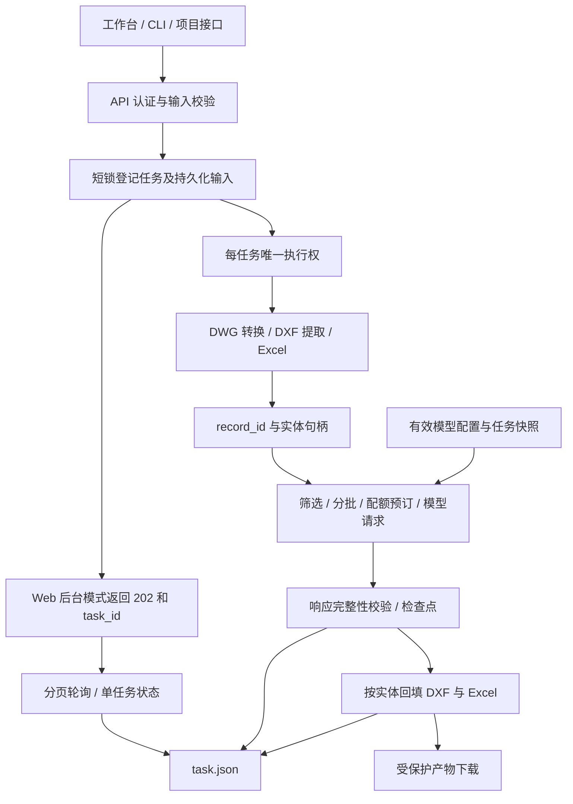

# CAD 翻译系统架构

系统采用模块化单体。Web、CLI 和旧项目接口共用 `backend/app` 下的 CAD 与 LLM 实现；发布目录是构建产物，不是第二套源码。

## 主链路

`POST /api/cad/upload` 的 `background=true` 模式在输入保存后返回；同步模式保留给现有调用方。后台任务使用有界本地执行器。进程中断后，启动恢复检查将失去执行者的任务标记为可恢复错误，由用户继续执行，不自动发起新的模型请求。

## 职责边界

| 模块 | 职责 |
|---|---|
| `services/cad_pipeline_service.py` | 统一门面与兼容导出 |
| `services/cad_task_jobs.py` | 输入登记、后台容量、执行所有权、恢复、下载快照 |
| `services/cad_task_processing.py` | 提取、翻译、恢复与回填的阶段编排 |
| `services/cad_task_translation.py` | 模型配置快照、进度与翻译检查点 |
| `services/cad_task_storage.py` | 元数据原子读写、生命周期锁和取消标记 |
| `services/cad_task_artifacts.py` | 状态摘要、列表、停止、删除及产物定位 |
| `functions/` | DWG 转换、DXF 实体提取和回填 |
| `services/llm/` | 服务商注册、协议适配、传输、限流、提示和 Excel 翻译 |
| `services/cad_processor.py`、`cad_text_processor.py` | 旧调用形式到可信实现的兼容层 |

工作台的模型设置是当前前端配置入口；协议、配置保存和凭据契约见 [LLM 配置说明](LLM_PROVIDERS.md)，接口使用见 [前端接口说明](FRONTEND_API_SPEC.md)。

## 状态和并发约束

- 任务目录中的 `task.json` 和检查点是 CAD 任务的持久化事实。旧 SQL 项目保留项目及文件关系，调用相同 CAD 流程；项目摘要同时展示项目和独立 CAD 任务。
- 全局创建/清空锁用于协调任务集合。单张图纸的转换和 Excel 生成不占用全局登记锁。
- 同一任务的执行锁覆盖模型调用与回填，重复执行返回冲突。生命周期锁保护该任务的文件读写和删除，文件锁保护单份元数据。锁序为执行权、生命周期、文件；停止/删除不反向等待执行锁。
- 取消阻止后续工作。在途网络请求或 CAD 转换受自身超时约束，取消请求不等同于这些调用已立刻终止。
- 删除后的写入不会重新创建任务目录。下载先在生命周期锁下复制快照，再流式发送；响应完成清理快照，遗留下载文件按到期策略回收。
- 任务 JSON 是权威记录；可重建 SQLite 摘要索引用 SQL 分页，规范保存和删除同步更新索引。启动校验文件签名并导入旧记录；索引异常回退 manifest 扫描。首次导入与启动校验仍随历史量增长，常规分页不再逐条读取历史 JSON。测量条件和数据见 [性能验证](CAD_PERFORMANCE_VALIDATION.md)。

## 翻译与回填约束

提取记录保留 `record_id` 和 DXF 实体句柄。人工回填优先使用记录 ID，因此同一原文的两个实体可以接受不同译文。旧版仅按原文提交的格式仍可使用，但同一原文的冲突译文会被拒绝，调用方须补充记录 ID。

JSON 翻译响应需要通过完整性与类型校验。缺项、空项和错误标记进入失败记录；恢复合并已成功记录并补齐尚未完成的记录，不能仅凭已有输出文件宣称整项任务成功。

配置快照固定一次执行的非敏感参数，凭据在运行时解析；任务文件和配置摘要不持有可回读的整组明文密钥。连接测试和翻译共用传输配置。进程内的配额与并发上限由统一 LLM 执行器约束；共享一个供应商配额的多进程部署须结合实际账户限制评估容量。

## 交付边界

Windows 启动器将代码缓存与用户数据分开：代码由 payload 哈希标识，数据库、输入、输出与配置持久化到用户数据目录。发布装配、目录/归档验收和版本门禁见 [发布说明](RELEASE_SCALE.md)。版本仅以 `backend/app/version.py` 为准。

真实性能取决于图纸结构、转换器、模型响应、配额和存储。优先测量各阶段及端到端延迟，再调整批量与并发；不以测试中的合成网络延迟推断生产模型吞吐。
