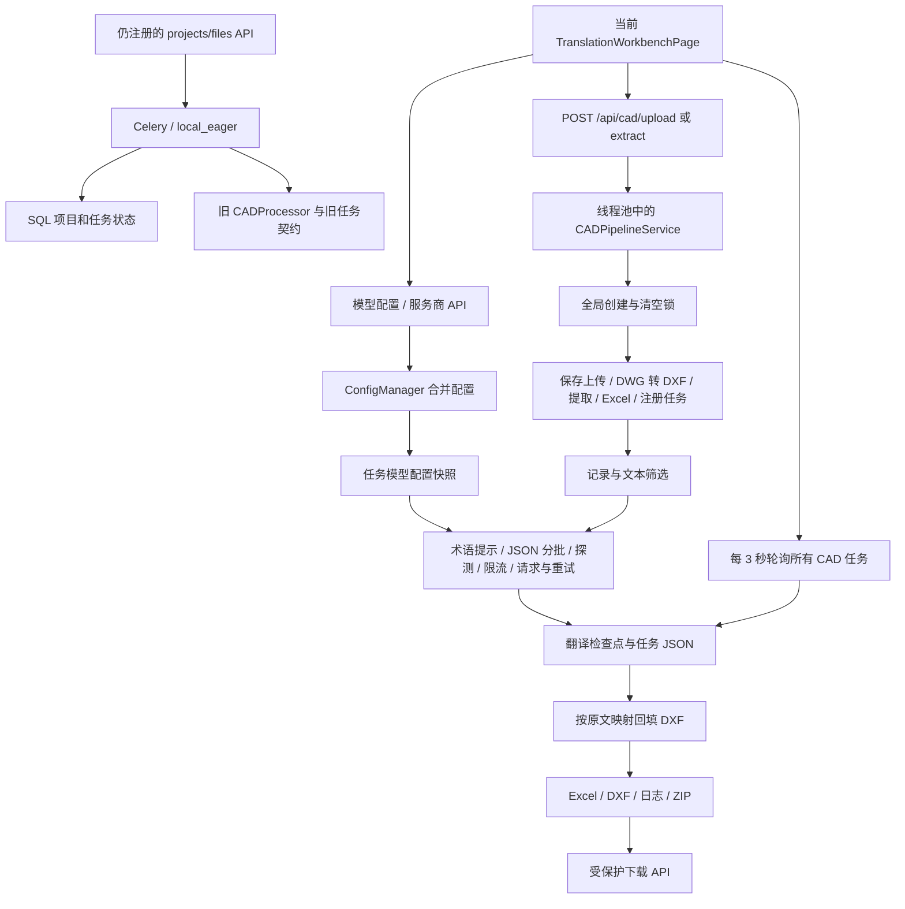

# CAD 翻译系统全链路审查报告

审查日期：2026-09-05（北京时间）。审查基线：`b9ca0ea06da2f2f3897bb2ef135767cee0c3370e`。本文是该提交的审查快照，不代表后续版本状态。

本次范围：当前 Web 工作台、模型配置及请求协议、上传/转换/提取/翻译/回填/下载、任务并发与恢复、Windows 便携 EXE、CNB 发布自动化、仍注册的旧项目接口。没有修改业务代码、调用真实付费模型或运行真实 DWG/COM 转换；没有执行部署或重新发版。

## 1. 结论与处理顺序

系统已经具有可用的现代 CAD 处理主干、任务隔离、原子文件写入和较多并发回归测试。当前主要风险集中在边界契约：模型配置与前端状态不一致、翻译响应校验不足、并发锁覆盖过大、发布包生命周期与数据持久化混用，以及旧接口仍连接到漂移的实现。

推荐保留模块化单体，以一个任务存储、一个后台执行入口、一套模型配置契约和一个发布装配器收敛实现。当前没有证据支持先拆微服务或更换前端框架。

处理顺序：

1. 修复 EXE 数据持久化、密钥返回/打包边界、模型配置加载与误清空密钥、翻译漏项假成功。
2. 修复并发探测等待、限流预订、全局注册锁范围、任务重复执行与取消。
3. 收敛后台任务和存储，缩短 HTTP 请求生命周期，补齐发布产物验收。
4. 基于真实图纸和供应商配额做容量测试，再调整批量、并发和缓存策略。

严重度：P1 表示可能丢失数据、错误交付、破坏核心流程或显著拖慢系统，建议下一次交付前处理；P2 表示应计划修复的能力缺口、规模风险或维护问题。条件性问题注明触发条件，不把它们写成已经发生的线上事故。

## 2. CNB 云端执行核实

云端确实已执行 Windows EXE 自动打包，且发布附件存在。

| 项目 | 已核实事实 |
|---|---|
| 最新已查到的 EXE Tag 构建 | `cnb-h4o-1k1ook7f5`，`tag_push`，`v0.1.1`，状态 `success` |
| 构建开始 | 2026-09-05 20:27:52 北京时间 |
| 构建耗时 | 658.597 秒，约 10 分 59 秒 |
| 对应代码 | 本报告审查基线提交 |
| Windows ZIP | `cad-translation-web-v0.1.1-windows-exe.zip`，75,186,802 字节 |
| 附件 SHA-256（CNB 元数据） | `0e32d9c4e4eb3eff875d2b50f8566cd38bb157e9045a3b44f9c18d040399088b` |
| 同时存在 | `cad-translation-release-v0.1.1.tar.gz` |
| 主分支校验 | `cnb-7qo-1k1oodb0g`，前后端两条 pipeline 成功 |

来源：[EXE 构建记录](https://cnb.cool/star_fu/cad-translation-web/-/build/logs/cnb-h4o-1k1ook7f5)、[Release 与附件](https://cnb.cool/star_fu/cad-translation-web/-/releases/tag/v0.1.1)、[主分支 CI](https://cnb.cool/star_fu/cad-translation-web/-/build/logs/cnb-7qo-1k1oodb0g)。通过已登录 CNB CLI 读取了构建、Release、PR 和 Issue 评论元数据；未下载并启动该 EXE，附件校验值未做独立下载复算。

Issue #6 的评论明确记录了 CodeBuddy 的工作模式执行和提交 PR #7/#8。因此存在“自动化代理编写发布流程”和“CI 执行打包”两个环节。[Issue #6](https://cnb.cool/star_fu/cad-translation-web/-/issues/6)

后续云端 Wine 打包重构已通过 PR #31 合并；该 PR 的作者元数据是用户账户，不能仅凭之前的机器人评论把每一次后续修改都归因于 CodeBuddy。[PR #31](https://cnb.cool/star_fu/cad-translation-web/-/pulls/31)

此前完成的 GitHub 同步覆盖 `main` 代码；Git 推送不会自动复制 CNB Release 附件。

## 3. 实际链路与状态边界

这次审查对象是 CAD 系统。对应链路是上传、转换、提取、筛选、翻译、回填与交付；没有将其他信息系统的“事件、精选、聚簇”概念硬套进来。

现代 CAD 上传已经使用 `run_in_threadpool`，因此不能笼统说所有 CAD 转换都会阻塞事件循环。但 HTTP 仍要等待整条流程完成；另外部分文本翻译和连接测试接口仍在 `async def` 中直接调用同步网络函数。

## 4. 模型选择与配置：用户观察的原因

只读检查的本地有效配置能得到 18 个服务商预设：17 个内置预设和 1 个持久化自定义预设。当前主配置为 `minimax-cn`、`openai_compatible`、`https://api.minimaxi.com/v1`、`MiniMax-M2.7-highspeed`。这表示本地配置解析的结果，不代表已验证该远程模型可用，也不代表其他机器上的 EXE 使用同一配置。

本地配置路径是 `C:\Users\zhenhe\.config\cli-anything-cad\config.json`，自定义服务商保存在同目录的 `custom_providers.json`。用户目录内的自定义配置不是 Git 源码，云端构建不会自动带上它。交付给其他机器时应支持显式导入不含密钥的服务商配置，而不是复制本机凭据。

### M1 · P1：配置加载任一请求失败，服务商列表可能只剩 Custom

证据：`frontend/src/pages/TranslationWorkbenchPage.tsx:482` 初始化空预设；`:532` 使用 `Promise.all` 获取配置、服务商和语言；`:540` 的默认预设回退只在三个请求全部成功后执行；`:603` 捕获错误时仅显示消息；`:1641` 渲染下拉框。

同时 `frontend/src/services/api.ts:12` 的 Axios 实例没有 Admin Token 注入，而配置和服务商接口要求 Admin Guard。普通 Web 部署开启 Guard 时，即使后端拥有完整预设，页面也可能因 403/503 呈现空服务商列表。EXE 默认关闭 Guard，该触发条件在那里不一定成立；网络或其他配置请求失败仍可触发同样的 UI 问题。

建议：显式区分“认证失败”“配置未加载”“可用服务商列表”；独立处理三个请求，失败可重试；所有 API 和 blob 下载统一认证客户端。不能用默认列表掩盖认证失败并让用户误以为配置已保存。

### M2 · P1：只修改非密钥设置，也可能清空原有主模型密钥

证据：工作台 `:569` 只从 `provider_api_keys[provider]` 初始化输入框；`:984` 总是发送 `api_key`，空输入也发送空字符串。`runtime_config_service.py:414` 将显式空值视为清空操作。

触发：配置仅在 `llm.primary.api_key` 保存密钥，没有对应的 provider map 项。用户打开页面，修改温度并保存；空输入被发送为清空指令。隔离配置实验确认 provider map 没有 key 时，按工作台空值契约保存会清空 primary key。结果是此前可用的配置在一次普通保存后失效。

建议：密钥采用“未修改 / 替换 / 显式删除”三态契约。常规保存不传密钥；单独提供删除操作。服务端返回配置状态及掩码即可。当前 `docs/modern/FRONTEND_API_SPEC.md:112` 的“空值不发送”说明与活跃工作台不符。

### M3 · P1：配置摘要返回整组真实 provider API keys

证据：`backend/app/services/runtime_config_service.py:384` 获取有效配置，`:389` 原样返回非空 `provider_api_keys`；工作台 `:567` 将它们放入 React 状态。

这是受保护配置接口中的敏感字段暴露，不应误称为在所有部署中匿名公开；但任何能打开设置页的客户端都会取得整组密钥，便携模式又默认关闭 Guard。主密钥有掩码并不等于整个响应都已脱敏。

建议：返回每个服务商的 `configured/source/masked` 状态；密钥只允许写入，不应全量回读。同步修复 M2，避免隐藏密钥后进一步诱发误清空。

### M4 · P2：后端能力和活跃前端的模型配置能力不对齐

| 能力 | 当前实际行为 | 建议 |
|---|---|---|
| 独立模型网关页面 | `ModelGatewayPage` 存在，`App.tsx:9` 仅挂载工作台；文档中的 `/gateway` 未接入 | 确定一个配置界面为权威实现，避免修到闲置页面 |
| fallback 模型链 | 后端 `translation_service.py:1206` 会尝试，工作台 `:973` 仅透传，无添加/排序/编辑入口 | 做可编辑的有序备用配置，并记录实际命中的模型 |
| 自定义协议 | `add_custom_provider` 在 `translation_service.py:298` 固定为 OpenAI compatible | 将协议类型纳入自定义配置，展示协议所需字段 |
| 多服务商模型记忆 | 工作台 `:485` 仅 React state；刷新只恢复当前服务商模型 | 持久化完整 profile，而非分别保存零散 URL、模型、密钥 map |

后端支持多个协议不等于所有自定义服务商都能使用这些协议；内置 Anthropic/Google 条目与自定义网关需要分开验证。

### M5 · P2：切到 Custom 会继承前一个服务商的 URL、模型和密钥

证据：工作台 `:849` 设置 provider 后，对 `custom` 提前返回，跳过后面的 URL/model/key 更新。删除当前自定义服务商时 `:920` 也只改 provider。

建议：加载完整的目标 profile；没有 profile 就明确初始化新配置。不要让服务商标签改变，而端点和密钥悄悄沿用。

### M6 · P2：自定义预设 ID 可覆盖内置项，且中文名字无法生成合法 ID

证据：工作台 `:883` 根据显示名生成 ASCII slug；后端 `translation_service.py:291` 直接写入 `PROVIDER_PRESETS`，无内置 ID 冲突校验；持久化 `:234` 又排除内置 ID。

触发：新建名为 OpenAI 的自定义服务商，会临时覆盖内置项；重启后恢复，用户看到“保存成功但配置不稳定”。中文显示名经过当前转换可能得到空 ID。

建议：系统生成稳定 ID，中文名称只是显示字段；禁止覆盖内置 ID，对更新和新增分开建模。

## 5. 全链路正确性、并发与性能

### P1 · 并发连接探测存在持锁等待，快请求被拖到超时

证据：`translation_service.py:999` 持有 `_rate_lock`，`:1007` 在锁内 `event.wait(timeout + 5)`；完成探测的线程又必须在 `:1177` 获取同一把锁才能唤醒等待者。

隔离实验从原文件 AST 提取原方法，模拟一次网络请求只耗时 0.1 秒，两个并发探测总耗时 **5.109 秒**，配置 timeout 为 0.1 秒。这个数字证明锁等待放大，不是生产模型测速。实际 timeout 更大时，等待窗口也随之扩大；同一个锁还承担限流状态更新，会扩大影响。

建议：锁内只注册/读取 in-flight 状态，锁外等待；完成路径在 finally 中发布结果和唤醒。缓存键包含协议及凭据版本，不保存明文密钥；凭据变化应失效旧探测缓存。避免把 `/models` 成功当成所有实际生成请求的必要前置条件。

### P1 · 限流器没有为等待者预订配额，会形成请求扎堆

证据：`translation_service.py:351` 的 token bucket 缺配额时把 tokens 设为 0，但没有记录未来已欠的额度；`:520` 释放锁后统一 sleep。

隔离实验：容量 1、每秒补充 1 token、同一时刻 4 次申请，返回 `[0, 1, 1, 1]` 秒。后 3 个请求一秒后同时放行，而不是依次取得配额。生产风险是 429、重试增加、吞吐下降和费用波动。

建议：使用基于单调时钟的配额预订或循环重新校验；等待可被取消。先修进程内正确性，再按供应商账户/端点组织全局并发和配额。只有确实多进程共用一个配额时，才引入跨进程协调。

### P1 · 创建任务的全局锁覆盖转换、提取和 Excel 生成

证据：`cad_pipeline_service.py:893` 持全局创建/清空锁，调用 `_register_uploaded_task`；`:940` 转换 DWG，`:947` 提取，直到首次 task.json 保存才释放。

这是为处理清空与创建竞态引入的真实保护，但临界区过大。慢 COM 转换可阻挡另一个完全独立的 DXF 任务创建；增加前端并发不能解决。

建议：先短事务/短锁登记任务与独立目录，重型阶段在任务自身执行权下运行。清空先标记删除/取消，再等待相应任务释放资源。保留现有 create/clear、stage/delete 回归测试，不能简单移除锁换取速度。

### P1 · 模型返回合法但不完整 JSON，漏译会显示成功

证据：`translation_service.py:1349` 使用 `parsed.get(text_i, original)`；`cad_pipeline_service.py:1152` 只把错误标记或空字符串算失败。

隔离实验：输入“阀门、压力”，模型仅返回 `text_0` 的译文；缺失的 `text_1` 原样返回“压力”，进入后端的成功分支。这是翻译协议错误，不是语言模型质量偏好。

建议：校验响应必须是对象、包含完整预期 ID、每项类型正确；缺项单独失败或重试。显式保留原文要记为 skipped，并附原因，不能和漏项共用隐式原文 fallback。

### P1 · 长任务请求和重复 resume 缺少统一执行所有权

证据：`api/routes/cad.py:137` 在线程池中等待完整 `process_upload`；工作台请求 timeout 为 900,000 毫秒（`services/api.ts:18`）。`cad_pipeline_service.py:1463` 的 resume 没有入口级原子 claim；最终回填锁不能防止两个请求同时调用模型。

影响：长连接断开不能自然等同于任务取消；线程池容量被重型请求占用；重复恢复可能重复计费、覆盖检查点和结果。现代任务已有 ID 和检查点，可据此渐进改造。

建议：上传持久化后返回 `202 + task_id`；一个有界后台执行器接管流程。原子 claim 同一任务，仅允许一个执行者，重复请求返回 409 或同一任务状态；恢复使用幂等键。不要把整条耗时流程塞进数据库事务。

### P2 · 取消检查不足，已提交的 JSON chunk 仍可继续调用模型

证据：`translation_service.py:1508` 一次提交全部 chunk；worker 的 JSON 分支 `:1434` 在网络请求前没有取消检查；消费 future 时才检查取消。退出 `ThreadPoolExecutor` 上下文会等待未完成工作。

建议：只保留有限数量在途 chunk，启动每次网络请求和重试之前检查取消；取消未启动 futures；运行中的请求依赖有界超时及可取消 I/O。取消按钮应显示“停止接收新工作 / 等待在途调用结束 / 已停止”的实际阶段。

### P2 · 文本和连接测试接口存在事件循环阻塞

证据：`routers/translation.py:80` 的 async 文本接口直接调用同步 translate_text；`:345` 的连接测试直接执行同步 service；LLM 适配器使用 requests。`main.py:113` 旧简易翻译接口也如此。

建议：短期把同步调用明确卸载到有界线程池；后续可统一异步 HTTP client。不要只把函数改成 async 而继续调用同步 I/O。FastAPI 官方说明同步阻塞调用与 async 路由的选择及执行边界：[Concurrency and async / await](https://fastapi.tiangolo.com/async/)。

### P2 · “关闭系统代理”对 ALL_PROXY 不完全生效

证据：`translation_service.py:495` 返回 `{'http': None, 'https': None}`；requests 的环境合并仍可保留 ALL_PROXY。

离线实验设置合成 ALL_PROXY 后调用 requests 的配置合并方法，结果仍存在 all 代理项，没有执行网络请求。

建议：为明确直连的 Session 设置 `trust_env=False`，明确区分直连、系统代理和显式代理；连接测试与实际翻译使用同一 transport 配置。不要通过禁用 TLS 校验解决代理问题。

### P2 · 回填丢失实体身份，同文不同译无法表达

证据：`cad_pipeline_service.py:952` 提取记录有 record_id；`:1766` 回填最终收敛为 `{original: translated}`；`functions/text_applier.py:124` 按文本匹配。

建议：规范化记录保留 entity handle、空间/块路径及 record_id；优先按实体定位回填，按原文匹配仅做明确的兼容路径。翻译去重键应包含必要上下文，不能无条件把整张图纸同文合并。

### P2 · 轮询与产物存储随历史量增长

证据：工作台 `:642` 每 3 秒拉取所有任务；`:1073` 对 silent 轮询没有 in-flight 防重。任务列表服务扫描文件系统状态。批量 ZIP 保存在 `cad_pipeline_service.py:2057` 的 `_packages` 路径，缺少自动到期回收；旧 `routers/files.py:333` 的临时 ZIP 也缺响应后清理。

建议：列表分页、按更新时间增量拉取、无在途重叠、隐藏页面降频、空闲退避；必要时再加 SSE。下载产物使用明确 TTL 或响应完成后的受控清理，保留可重新生成能力。不能为了实时感持续全量刷新多年历史。

## 6. 发布包与访问边界

### R1 · P1：EXE 默认退出清理会删除任务数据

证据：`release_exe/launcher.py:164` 使用固定 TEMP 根；`:136` 切到临时 backend；`config.py:80`、`:217`、`:228` 把默认数据库和上传/输出目录放在 backend 下；`launcher.py:220` 退出时清理整个 root。

默认配置下，保存在该目录内的任务历史、上传副本、Excel、DXF 和数据库会随退出被清理。用户已下载到其他目录的副本不受该代码删除；用户目录中的全局模型配置也独立保留。没有把所有用户文件都说成会丢失。

建议：应用代码缓存、长期用户数据和临时工作目录彻底分开；用户数据放固定 LocalAppData 目录或明确选择的目录；升级只换代码，不删除数据。用重启后历史/下载仍可用的验收测试约束。

### R2 · P1：解压互斥和版本复用不可靠

证据：`launcher.py:69` 的锁函数仅返回 bool，丢失原始 fd；`:178` 重新打开另一个 fd；拿锁失败仍进入解压。根目录固定，复用只检查 `backend/app/main.py` 是否存在（`:169`），没有 payload 哈希/版本校验。

影响：并发实例可互相删除运行目录；保留临时目录或异常退出后，新 EXE 可能复用旧代码/旧前端。这也可能造成“换了包，页面仍没变”的体验，但本次没有启动 EXE 复现具体机器上的现象。

建议：使用 payload 哈希标识代码缓存，持有并正确释放同一个锁句柄；锁失败明确退出或复用已验证的就绪实例。解压先 staging 后原子发布。不同实例不能清理彼此的活动目录。

### R3 · P1：打包密钥清洗漏项，开发目录排除不足

证据：`scripts/build_exe_payload.py:72` 只按 `api_key` 等字段名清理，漏掉 `provider_api_keys` 下按服务商命名的值；`:29` 没有排除 .venv 和日志。PowerShell EXE 装配也存在同类规则重复。

合成数据实验确认：primary key 被清空，provider map key 没有清空；`backend/.venv/Scripts/python.exe`、`backend/logs/server.log` 没有被规则排除。

这是可复现的打包器缺陷，尤其影响在含本地配置和虚拟环境的工作区打包。未对本次 CNB 附件内容做解包，因此不据此断言该云端 ZIP 已泄露真实密钥。

建议：不打包任何个人运行配置；发布白名单 manifest 为唯一来源；在最终 ZIP 和内层 payload 上执行字段级 secret guard、禁止目录校验与文件大小预算。不要在多个脚本中复制排除正则。

### R4 · P1：Admin Guard 被静态文件和旧翻译入口绕过

证据：`main.py:87`、`:88` 挂载 uploads/outputs，无 Guard；`:111` 的 `/api/translate` 无 Guard。

隔离 TestClient 实验启用 Guard 并设置测试 Token：匿名 `/api/cad/tasks` 返回 403；匿名读取合成 `/outputs/audit-public.txt` 返回 200；匿名 `/api/translate` 返回 200，并确实调用被 mock 的翻译函数一次。

建议：敏感文件统一由受保护下载端点返回；旧翻译入口加同等权限或有计划地退役。单租户共享令牌可保留，不必为修复此缺陷先引入多租户账户系统。

### R5 · P2：云端构建成功与 Windows 实际可用之间缺验收门槛

当前 Tag 流程 `.cnb.yml:101` 不强制引用同 SHA 的测试成功结果，不做最终包内容审计和 Windows 启动/重启测试；`:211` 上传失败可被 `|| echo` 吞掉。本次附件确实存在，因此上传吞错是未来风险，不是本次失败。

此外，干净 Git checkout 中没有跟踪的 tools 文件，源码包创建 tools 目录却未复制它；缺少已安装 CAD/ODA 的 Windows 机器是否有可用 DWG 后端不能由“EXE 构建成功”推断。应下载或注入固定版本、校验摘要的转换工具，并在 manifest 声明实际能力。

发布版本当前也不一致：CNB Tag 为 v0.1.1，后端规范版本源报告 2.0.0，frontend package 元数据为 1.0.0。前端包版本可以独立演进，但发布 Tag 与用户看到的应用版本必须有明确映射。建议 Tag 校验 SemVer 并与 canonical 应用版本一致，不追改已有历史 Tag。

`docs/modern/RELEASE_SCALE.md:88` 仍描述 Windows 自托管 Runner，实际流程使用 Wine 镜像；应在修复发布流程时同步更新。PyInstaller 运行机制和平台依赖见[官方说明](https://pyinstaller.org/en/stable/operating-mode.html)。该说明不能替代本项目生成 EXE 的真实 Windows 验证。

## 7. 旧链路与架构债务

以下问题主要影响仍注册的项目/文件 API；当前工作台主流程不能全部算作已受影响。

| 问题 | 证据 | 建议 |
|---|---|---|
| 项目批处理调用不存在的方法 | `tasks/cad_tasks.py:319` 调用 `CADProcessor.process_project_files`，类无该方法 | 将保留的接口转到唯一 pipeline，或明确退役；补真实任务契约测试 |
| 派发先于任务记录落库 | `routers/projects.py:375` delay 在 ProcessingTask 创建之前 | 先创建 durable 任务再派发；覆盖 eager 模式完成/失败后不能留下 pending 状态 |
| 旧 CAD 翻译 task 参数和 async 契约错误 | `tasks/translation_tasks.py:287` 传不存在的 file_path/project_id；目标方法为 async | 当前先会参数错误；即使只修参数，仍需处理 await，不能只修一半 |
| 重复上传去重查询无效 | `routers/files.py:75` UUID 文件名；`:86` 却在路径中查内容 hash | 显式 content_hash 字段及项目内唯一约束 |
| 删除项目仅删数据库行 | `routers/projects.py:315`；上传物理目录在 `routers/files.py:58` | 受控产物清理及失败重试，避免删除后仍可下载或占盘 |
| SQL 和 JSON 两套状态不一致 | `routers/projects.py:118` 仅 SQL 为空时回退现代 task；现代任务存 task.json | 选一个权威任务存储，使用迁移适配，而非条件拼接统计 |
| 下载与删除/回填竞态 | `cad_pipeline_service.py:2072` 读元数据后直接 archive.write，无产物快照 | 按任务执行权/锁复制稳定快照，再压缩；避免长期持锁压缩 |

按实际物理行计数，工作台 2,735 行、CADPipelineService 2,110 行、LLMTranslationService 1,647 行，超过项目单模块 800 行规则。这不是纯风格问题：配置状态、任务生命周期、网络协议与 UI 展示相互缠绕，修复易遗漏。

推荐模块边界：

- `ProviderProfile / CredentialStore / EffectiveConfig`：一个配置解析入口，输出脱敏状态和任务快照。
- `TaskService / TaskRepository / Executor`：登记、执行权、状态迁移、恢复；便携版用本地有界 worker，共享部署按需使用 Celery。
- `Converter / Extractor / Translator / Applier`：每个阶段只完成一种转换，不各自再实现整套流程。
- `ArtifactStore`：持久化、下载、保留期限、清理；与应用缓存分离。
- `ReleaseAssembler`：同一白名单与 manifest 服务于本地和云端；构建器只负责特定工具链。

建议在已有 SQL 能力上逐步统一任务索引和执行权，图纸与大检查点继续保存为文件。SQLite 单机方案先保留；是否迁移数据库由写入竞争和部署需求决定。不要同时换数据库、队列、模型引擎和前端，导致缺陷来源无法归因。

## 8. 性能评价与容量验证方案

没有真实图纸和模型配额下的对照压测，本报告不提供虚构的 QPS、最高并发或“提升十倍”承诺。已实测数字仅用于验证具体机制缺陷。

| 路径 | 当前评价 | 首先验证/优化 |
|---|---|---|
| DWG 转换 | 受 CAD 启动和 COM 约束；全局锁额外阻挡其他任务 | 分离全局登记锁与 COM 专用信号量，默认保留 COM 串行保护 |
| DXF 提取/Excel | 可能随实体数、块引用和重复文字增长 | 10k/100k 实体固定样本，记录阶段 CPU、RSS、读写量 |
| LLM 翻译 | 已确认探测锁和配额缺陷；大 chunk 失败可退化到逐条调用 | 修复后测试并发 1/2/4/8，记录成功吞吐、429、token 和成本 |
| 回填 | 实体身份与文本映射混用，质量约束先于提速 | 建立 record_id 回填正确性及残留文本验收 |
| 历史/下载 | 全量轮询、文件扫描、ZIP 留存有规模风险 | 100/1,000/10,000 任务的列表 P95、目录大小和磁盘占用 |
| EXE 启动 | 无有效缓存版本校验，数据与代码混用 | 首次/二次启动、升级、重启、双实例的功能与耗时测试 |

每个 task 使用单调时钟记录排队时间、转换、提取、模型等待/生成、检查点写入、回填及产物生成。报告 P50/P95、失败/重试比例、峰值 RSS、CPU、总 token、每千条成功译文成本和残留漏译数。新增指标只使用当时已发生的数据；滚动指标明确窗口结束时间，满足项目的时序 shift 要求。

理论容量需要同时受约束：请求速率上界不超过 `min(C/L, RPM/60, TPM/(60×每请求token))`，其中 C 为实际全局并发、L 为实测平均请求延迟。该式只是稳态估算；批量失败、重试、供应商共享配额会降低实际吞吐。

缓存优化应后置于正确性：先按原文、源/目标语言、必要实体上下文去重，再按模型 profile、提示词版本、术语表摘要构建缓存键；只缓存校验通过的结果。不能仅按原文缓存，造成更换语言/术语表后得到旧译文。

建议验收目标是“控制面在翻译中保持响应、停止后不再发起新调用、相同任务只执行一次、重启后产物可用、任何漏项不会标成功”。先建立目标与基线，再给出具体延迟/容量 SLA。

## 9. 已执行验证与证据边界

| 验证 | 结果 |
|---|---|
| `PYTEST_DISABLE_PLUGIN_AUTOLOAD=1`、`PYTHONDONTWRITEBYTECODE=1`，后端虚拟环境 `python -m pytest tests -q -p no:cacheprovider` | **183 passed，32 warnings，315.92 秒** |
| 前端 `npm run lint` | 通过 |
| 前端 `npx tsc --noEmit` | 通过 |
| CNB 构建/Release/PR/Issue 元数据 | 上述云端执行结果已核实 |
| 两线程 probe，模拟 HTTP 0.1 秒 | 总耗时 5.109 秒，确认锁等待放大 |
| token bucket 同时 4 次配额申请 | `[0,1,1,1]`，确认无等待者配额预订 |
| 漏 JSON key | 原文被静默返回，确认协议漏项 |
| 合成 primary-only 密钥配置按工作台空值契约保存 | primary key 被清空，确认普通保存存在误删密钥路径 |
| Guard 开启的隔离 TestClient | 受保护任务 403；静态产物 200；旧翻译调用 200 |
| 合成配置打包清洗 | primary 被清理；provider map 未清理；.venv/log 未排除 |
| 关闭代理的离线环境合并 | ALL_PROXY 仍生效 |

隔离实验使用合成数据、mock 网络和系统临时目录，未发送真实图纸。部分实验从原文件 AST 提取方法执行，用于验证局部机制，不等同于完整生产环境端到端测试。现有测试通过证明已覆盖场景没有回归，不代表本报告的新缺陷已被现有测试覆盖。

未执行：实际发布 EXE 启动、真实 Windows COM 转换、多浏览器视觉验收、真实供应商调用与计费、生产规模压测、云端 ZIP 下载解包。对应结论已限制为源码可证实行为或待验证风险。

32 个测试 warning 主要是 SQLAlchemy/Pydantic 弃用 API，应在依赖升级前处理；优先级低于上述丢数据、错误翻译和配置问题。

## 10. 建议实施批次与验收

| 批次 | 变更范围 | 完成判据 |
|---|---|---|
| A：交付正确性 | 数据目录/解压锁；密钥三态和脱敏；配置加载恢复；JSON 响应验证；Guard 缺口 | 重启保留历史；新旧包隔离；未修改密钥不改变；漏项 partial；所有敏感下载受保护 |
| B：性能与执行契约 | probe 单飞；限流预订；短注册锁；任务 claim；有界取消；同步 I/O 卸载 | 并发探测不等 timeout；配额符合计划；独立 DXF 不受慢 DWG 注册阻挡；重复 resume 不增加模型调用 |
| C：架构收敛 | 一个 pipeline、一个任务索引、一个配置界面、一个发布 assembler | 旧 API 明确适配/退役；无双状态条件拼接；各模块遵守 800 行规则；同 SHA 产物验证可复现 |
| D：基准优化 | 真实样本、批量与并发调参、缓存、轮询与清理策略 | 正确性相同前提下提交阶段耗时、成功吞吐、成本和内存对照表 |

批次 A/B 的兼容性修复按项目 canonical 版本源遵循 SemVer 发布；若删除已公开 API 或改变配置含义，先提供迁移/兼容期，再按实际破坏性选择主版本。本文仅新增审查文档，不改变应用版本或运行行为。
